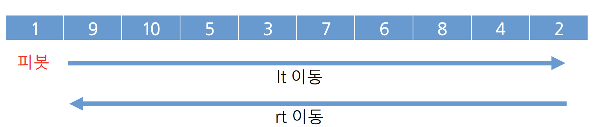

# QuickSort (퀵 정렬)

> 불안정정렬

- 다른 원소와의 비교만으로 정렬 (비교정렬)

- 매우 빠른 수행 속도 O(nlogn)

  

- 리스트를 비균등하게 분할 (vs MergeSort : 리스트 균등하게 분할)

- 분할 정복 중 하나 (Divide & Conquer)

- 대다수의 정렬 함수에서 사용하는 정렬 방식

  


### 방법

1. 리스트 안에 있는 한 요소 선택 (이 원소를 Pivot)

2. Pivot을 기준으로 작은 요소들은 왼쪽으로, 큰 요소들은 모두 오른쪽으로 이동

   (Pivot 중심으로 왼쪽 (Pivot 보다 작은 요소), 오른쪽(Pivot 보다 큰 요소))

   - 값을 찾는 방식

     - 왼쪽부터 자기보다 큰 값이 있는지 찾음
     - 오른쪽부터 자기보다 작은 값이 있는지 찾음

   - 값을 찾을 경우 서로 바꿔줌

     - 단, 왼쪽에서부터 확인하는 값의 index(lt)가 오른쪽에서부터 확인하는 값의 index(rt)보다 크다면, 

       Pivot을 작은 값. 즉, 오른쪽에서부터 확인하는 값(rt)와 바꿔준다.

     - 알고리즘화 시켰을 경우,

       ```java
       if(lt.index > rt.index){
         swap(pivot.value, rt.value);
       }
       ```

     

     

3. Pivot 제외한 왼쪽 리스트와 오른쪽 리스트 다시 정렬
   - 분할된 리스트에 recursive 호출 사용
   - 부분 리스트에서도 다시 Pivot정하고 정렬하고 나누는 과정 반복
   
4. 부분 리스트들이 더 이상 분할 불가능 할때까지 수행!

   - 파티션이 계속 나눠짐 -> 작은쪽 애들과 큰쪽 애들이 따로 정렬됨
   - 파티션내부에 2개만 남는 일이 생김 
     - 그 이후부터 각 해당 파티션들이 정렬된 상태로 반환되게 됨

5. 예시

   

   - 예시에서는 5를 pivot으로 설정해서 가운데로 옮기는 과정은 이미 생략한 상태!
   - pivot의 인덱스가 가운데 인덱스로 바뀜


### 단계

- 하나의 리스트를 Pivot을 기준으로 두개의 비균등한 크기로 분할하고, 분할된 리스트를 정렬한 다음, 두개의 정렬된 부분 리스트를 합하여 전체가 정렬된 리스트로 만드는 방식!!

1. 분할 (Divide) : Pivot 기준으로 2개로 나눔
2. 정복 (Conquer) : 부분 배열 정복
3. 결합 (Combine) : 정렬된 부분 배열들을 하나의 배열에 병합 (병합하면서 정렬 완료)


### 장점

- 속도가 빠름 O(**n**log**n**)

  

  

- 추가 메모리 공간 필요 없음


### 단점

- 정렬된 리스트에 대해서는 퀵 정렬의 불균형 분할에 의해 오히려 수행시간이 더 많이 걸림
  - 최악의 경우에는 마찬가지로 O(n^2)
  - 하지만 평균으로 O(**n**log**n**) 의 시간복잡도를 가짐
    - 그 이유는 파티션을 나누는 횟수가 n번인데 계속 나누다 보면 결국 파티션의 갯수가 낱개가 될때까지 나눔. 
    - 그런데 한번 나누고 2번째 나눌때는 n을 둘로 나눈 결과를 가지고 나누는것이기 때문에 검색해야하는 데이터의 양이 절반으로 줄어듬 -> logN이 되게 됨
    - 결국, n만큼 파티션을 나누기 때문에 **n**log**n** 이라는 시간 복잡도를 가지게 됨


### 정렬 알고리즘 비교

- 구현하기 쉽지만 비효율적인 방법
  - 삽입 정렬, 선택 정렬, 버블 정렬
- 복잡하지만 효율적인 방법
  - 퀵 정렬, 힙정렬, 합병정렬


### 구현코드

**pivot을 맨 왼쪽 원소로 잡으면 pivot을 중복해서 사용하는 경우가 발생하기 때문에 그것보다는 pivot으로 중간값을 넣어서 사용한다!!**

1. c++ 코드

   ```c++
   void QuickSort(int* data, int start, int end){
     // 원소가 1개인 경우 그대로 두기
     if(start >= end){
       return 0;
     }
     // pivot
     int pivot = data[(start + end) / 2];
     // lt는 왼쪽에서 시작, rt는 오른쪽에서 시작
     int lt = start , rt = end;
     // 값을 교환할때를 위한 변수
     int temp;
     
     // Pivot기준으로 왼쪽, 오른쪽 나눔 (병합정렬과 반대)
     // 왼쪽에서 시작된 인덱스(lt)가 오른쪽에서 시작된 인덱스(rt)보다 작을동안 반복
     while(lt <= rt){
       // lt의 값이 맨 오른쪽 인덱스인 end 값보다 작고,
       // lt index에 해당하는 값이 pivot index에 해당하는 값보다 작을때까지 반복
       // 왼쪽에서 시작된 값이 Pivot보다 큰 값을 발견했을 경우, 반복문 종료
       while(lt <= end && data[lt] <= pivot){
         lt++;
       }
       
       // rt의 값이 맨 왼쪽 인덱스인 start 보다 크고,
       // rt index에 해당하는 값이 pivot index에 해당하는 값보다 클때까지 반복
       // 오른쪽에서 시작된 값이 Pivot보다 작은 값을 발견했을 경우, 반복문 종료
       while(rt >= start && data[rt] >= pivot){
         rt--;
       }
       
       // 왼쪽에서 시작된 값이 Pivot보다 큰 것을 발견했을때 
       // 오른쪽에서 시작된 값이 Pivot보다 작은 값을 발견했을때
       
       // lt의 값이 rt보다 클 경우, 
       // 즉, 엇갈렸을 경우에는, 작은 값을 발견한 data[rt]와 pivot을 교환
       // 왼쪽에는 작은 값만 존재해야 하기 때문!
       if(lt > rt){
         temp = pivot;
         pivot = data[rt];
         data[rt] = temp;
       
       // lt의 값이 rt보다 작을 경우,
       // data[lt]와 data[rt]의 값을 서로 swap시킴
       // 바람직한 경우
       }else{
         temp = data[lt];
         data[lt] = data[rt];
         data[rt] = temp;
       }
     }
     
     // lt의 값이 더 커진 경우, 2개로 나눠서 Sort 수행 (재귀 이용)
     // rt의 경우 Pivot과 교환하여 Pivot 값이 들어갔으므로, 제외시키고 Sort 수행
     QuickSort(data, start, rt - 1);
     QuickSort(data, rt + 1, end);
   }
   ```

   

2. Java

   ```java
   package SortAlgorithm;
   
   import java.util.Arrays;
   
   public class QuickSortAlgorithm {
       public static int partition(int[] data, int start, int end){
           if(start > end){
               return 0;
           }
           System.out.println("partition 함수 실행!!");
           // int lt = start + 1;
           int lt = start;
           int rt = end;
           // 바로 밑의 2가지 사례의 경우 pivot이 중복해서 사용되는 경우가 있으므로 sorting이 제대로 이루어 지지 않는다.!!
           // int pivot = start;
         
           // 배열이 while문에서 변경되기 때문에 아래와 같은 방식을 사용하면 계속해서 변경된 data의 배열에 접근하게 됨
           //        int pivot = (start + end) / 2;
           // 이 방식을 사용하여야 while문 이전에 설정했던 pivot을 계속 이용
           int pivot = data[(start + end) / 2];
   
           System.out.println("pivot값 : " + pivot);
           System.out.println("lt's index & rt's index : " + lt + " / " + rt);
           while(lt < rt){
               while(lt < end && data[lt] < pivot){
                   lt++;
               }
               System.out.println("lt & value : " + lt + " / " + data[lt]);
               while(rt > start && data[rt] > pivot){
                   rt--;
               }
               System.out.println("rt & value : " + rt + " / " + data[rt]);
               if(lt < rt) {
                   int temp = data[lt];
                   data[lt] = data[rt];
                   data[rt] = temp;
                   System.out.println("lt is more left than rt ");
                   System.out.println("swap data between lt and rt: " + data[rt] + " / " + data[lt]);
                   // lt 가 rt 보다 작을때 값을 변경한 이후 배열 출력!
                   for(int ele : data){
                       System.out.print(ele + " ");
                   }
                   System.out.println();
               // lt가 rt보다 클 경우 rt와 pivot의 값을 변경한 이후 배열 출력!
               }else{
                   int temp = data[rt];
                   data[rt] = pivot;
                   pivot = temp;
                   System.out.println("rt is more left than lt ");
                System.out.println("swap data between pivot and rt: " + data[rt] + " / " + pivot);
                   // lt 가 rt 보다 작을때 값을 변경한 이후 배열 출력!
                   for(int ele : data){
                       System.out.print(ele + " ");
                   }
                   System.out.println();
               }
           }
           // rt 즉, pivot보다 작은 값을 이제 pivot과 바꿔주고 그 값을 리턴해서 pivot값을 기준으로 양쪽으로 배열을 나누어 주어야함!
           System.out.println("return하는 rt의 index & 값! : " +rt + " / " +  data[rt]);
           System.out.println("이것이 pivot이 되어서 이것을 기준으로 다시 나눠지게 됨!");
           System.out.println();
           return rt;
       }
   
       public static void quickSort(int[] arr, int start, int end){
           if(start < end){
               int p = partition(arr, start, end);
               System.out.println("partition 함수 실행 후 얻은 pivot의 값!!" + p);
               System.out.println(Arrays.toString(arr));
               System.out.println();
               quickSort(arr, start, p-1);
               System.out.println("왼쪽 끝!!");
               quickSort(arr, p+1, end);
           }
       }
   
   
   
   
       public static void main(String[] args) {
   //        int[] dataList = {5,3,8,4,9,1,6,2,7};
   //        int[] dataList = { 69, 10, 30, 2, 16, 8, 31, 22 };
           int[] dataList = { 3, 9, 4, 7, 5, 0, 1, 6, 8, 2 };
           System.out.println("정렬 전!!");
           System.out.println(Arrays.toString(dataList));
   
           quickSort(dataList, 0, dataList.length - 1);
           System.out.println("정렬 된 후!!");
           for(int data : dataList){
               System.out.print(data + " ");
           }
       }
   }
   ```
   
   


### 참고자료

> https://gmlwjd9405.github.io/2018/05/10/algorithm-quick-sort.html
>
> https://hongku.tistory.com/149